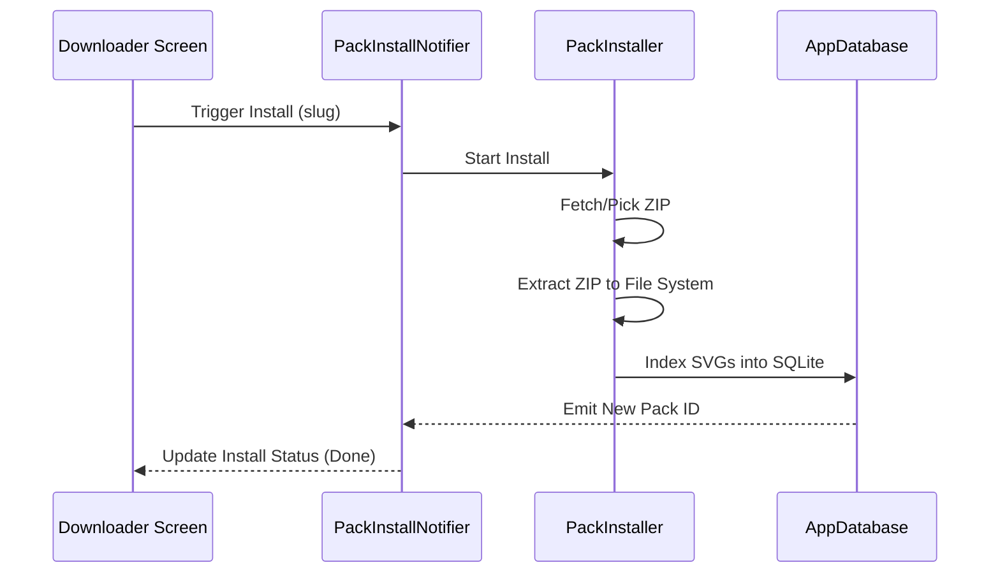

# How AssetBridge Works

AssetBridge functions by managing a fast, searchable index of local SVG files. This document explains the primary workflows of the application.

## 1. Icon Pack Fetching
AssetBridge supports two ways to add icons to your library:

- **GitHub Release Logic**: Connects to the GitHub API via the `GitHubReleaseClient`, fetches information about the latest release (zipball), and downloads the corresponding archive.
- **Local Selection**: Uses the native Linux file picker to select a local ZIP archive containing SVG files.

## 2. ZIP Extraction & Normalization
Once a ZIP archive is obtained, the `extractZipBytes` utility performs the following:

- **Path Normalization**: Strips the top-level repository folder (e.g., `phosphor-icons-core/`) to maintain a clean local folder structure.
- **Security**: Validates all paths to prevent common ZIP-slip vulnerabilities.
- **Persistent Data**: Extracted icons are stored in `~/.local/share/assetbridge/packs/<slug>/`.

## 3. Metadata Indexing (The Heart of AssetBridge)
After extraction, the `SvgIndexer` walks through the local folder and performs recursive indexing:

- **SVG Detection**: Identifies every `*.svg` file in the pack.
- **Tag Parsing**: Generates searchable tags by splitting the filename and directory structure.
- **Category Assignment**: Infers categories from the immediate parent directory (e.g., icons in `/regular/folder/` are assigned to the "regular" category).
- **SQLite Batch Insert**: Thousands of icons are indexed in chunks to ensure the UI remains responsive and the database remains fast.

## 4. Search & Discovery
The search engine performs lightning-fast queries across the **Assets table**. It searches for matches in:
- **Icon names**: `phosphor-heart.svg` -> "heart"
- **Tags**: Manually or automatically generated metadata.
- **Category filters**: Allows narrowing down searches to specific icon styles or groups.

## Visualization: Installation Lifecycle

